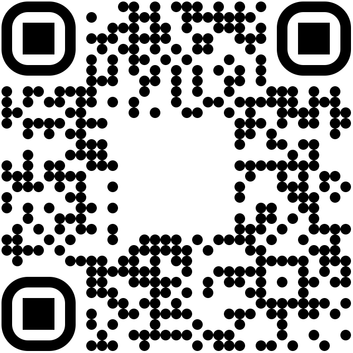

# AutomotiveGuide_es: Guía Automotriz en Español / Automotive Guide in Spanish

> **Repositorio**: [https://github.com/edgarefraindp/AutomotiveGuide_es](https://github.com/edgarefraindp/AutomotiveGuide_es)  
> **Para donaciones y soporte**: Visite la página del repositorio en GitHub

Esta es una guía práctica en español que explica los sistemas de vehículos modernos en términos simples, enfocada especialmente en sensores y actuadores electrónicos.

This is a practical guide in Spanish that explains modern vehicle systems in simple terms, with special focus on electronic sensors and actuators.

## Propósito / Purpose

Este repositorio contiene documentación y utilidades automotrices enfocadas en sensores y actuadores de vehículos modernos (2020 en adelante). El contenido está diseñado para cualquier persona con conocimientos básicos de mecánica automotriz que desee comprender los sistemas electrónicos en vehículos modernos, cerrando la brecha entre el conocimiento mecánico convencional y la electrónica automotriz.

This repository contains automotive documentation and utilities focused on modern vehicle sensors and actuators (2020 onwards). The content is designed for anyone with basic automotive mechanical knowledge who wants to understand electronic systems in modern vehicles, bridging the gap between conventional mechanical knowledge and automotive electronics.

## Tabla de Contenidos / Table of Contents

- [Introducción / Introduction](#introducción--introduction)
- [Documentación / Documentation](#documentación--documentation)
  - [Sensores y Actuadores / Sensors and Actuators](docs/sensores-y-actuadores.md)
- [Utilidades / Utilities](#utilidades--utilities)
  - [Arduino](utilities/arduino/arduino.md)
  - [ESP32](utilities/esp32/esp32.md)
- [Público Objetivo / Target Audience](#público-objetivo--target-audience)
- [Apoya el Proyecto / Support the Project](#apoya-el-proyecto--support-the-project)
- [Licencia / License](#licencia--license)

## Introducción / Introduction

AutomotiveGuide_es proporciona recursos en español para técnicos automotrices que están haciendo la transición de sistemas mecánicos tradicionales a tecnologías electrónicas modernas de vehículos. Con explicaciones claras, comparaciones con sistemas anteriores y procedimientos de diagnóstico simplificados, esta guía busca facilitar la actualización de conocimientos para mecánicos de todas las edades.

AutomotiveGuide_es provides resources in Spanish for automotive technicians transitioning from traditional mechanical systems to modern electronic vehicle technologies. With clear explanations, comparisons with previous systems, and simplified diagnostic procedures, this guide aims to facilitate knowledge updating for mechanics of all ages.

## Documentación / Documentation

El repositorio incluye explicaciones detalladas sobre:
- Sensores y actuadores de vehículos modernos
- Sistemas de control electrónico
- Procedimientos de diagnóstico paso a paso
- Recomendaciones de mantenimiento
- Comparaciones con sistemas anteriores
- Explicaciones en lenguaje sencillo con analogías prácticas

The repository includes detailed explanations about:
- Modern vehicle sensors and actuators
- Electronic control systems
- Step-by-step diagnostic procedures
- Maintenance recommendations
- Comparisons with previous systems
- Explanations in simple language with practical analogies

### Documentación Disponible / Available Documentation

Toda la documentación es accesible a través del índice principal:

All documentation is accessible through the main index:

- [Guía de Sensores y Actuadores / Sensors and Actuators Guide](docs/sensores-y-actuadores.md)

#### Contenido Detallado / Detailed Content

La guía cubre los siguientes sistemas y componentes:

The guide covers the following systems and components:

- **Sensores del Motor / Engine Sensors**
  - Sensor CKP (Posición del Cigüeñal)
  - Sensor CMP (Posición del Árbol de Levas)
  - Sensores MAF/MAP (Flujo/Presión de Aire)
  - Sensores de Oxígeno
  - Sensor de Temperatura del Refrigerante
  - Sensor de Detonación
  - Sensor de Posición del Acelerador
  - Sensor de Presión de Riel de Combustible
  
- **Sistema de Aceleración Electrónica / Electronic Throttle System**

- **Sensores de Emisiones / Emission Sensors**
  - Sensor de Temperatura de Gases de Escape
  - Sensor de Presión Diferencial (DPF/FAP)
  - Sensor NOx
  
- **Sistemas ADAS / ADAS Systems**

- **Sensores de Frenos / Brake Sensors**

- **Sensores y Actuadores de Cabina / Cabin Sensors and Actuators**
  - Sensor Anti-atrapamiento de Ventanillas
  - Sensores de Ocupación de Asientos
  - Sensores de Calidad del Aire
  - Sensores de Lluvia y Luz
  - Control de Climatización Automática
  - Motor de Ventana Eléctrica con Anti-atrapamiento
  - Espejos con Memoria y Ajuste Automático

- **Dirección Electroasistida / Electric Power Steering**

- **Actuadores Principales / Main Actuators**

- **Sistemas de Comunicación / Communication Systems**

- **Consejos de Diagnóstico / Diagnostic Tips**

Para cada sensor o actuador, se incluyen secciones sobre:
- ¿Qué hace?
- Comparación con modelos anteriores
- Cómo funciona
- Explicación en palabras sencillas
- Especificaciones eléctricas
- Síntomas de falla
- Mantenimiento
- Consejos prácticos
- Proceso de diagnóstico simplificado
- Compatibilidad y reemplazo

For each sensor or actuator, sections are included on:
- What does it do?
- Comparison with previous models
- How it works
- Simple explanation
- Electrical specifications
- Failure symptoms
- Maintenance
- Practical tips
- Simplified diagnostic process
- Compatibility and replacement

## Utilidades / Utilities

El repositorio incluye herramientas y recursos para técnicos automotrices que trabajan con vehículos modernos:

The repository includes tools and resources for automotive technicians working with modern vehicles:

### Arduino

- [Documentación de Arduino](utilities/arduino/arduino.md) / [Arduino Documentation](utilities/arduino/arduino.md)
- [Pulsador de Inyectores](utilities/arduino/pulsadorInyectores/manual_es.md): Herramienta para probar inyectores de combustible. / [Injector Pulser](utilities/arduino/pulsadorInyectores/manual_es.md): Tool for testing fuel injectors.

### ESP32

- [Documentación de ESP32](utilities/esp32/esp32.md): Proyectos basados en microcontroladores ESP32 para diagnóstico automotriz. / [ESP32 Documentation](utilities/esp32/esp32.md): ESP32 microcontroller-based projects for automotive diagnostics.
- [Pulsador de Inyectores ESP32](utilities/esp32/pulsadorInyectores_ESP32/manual_es.md): Versión mejorada del pulsador de inyectores basada en ESP32. / [ESP32 Injector Pulser](utilities/esp32/pulsadorInyectores_ESP32/manual_es.md): Enhanced version of the injector pulser based on ESP32.
- [Control de Marcha con Sensor MAP](utilities/esp32/encendidoElectronico1/manual_es.md): Sistema de control de marcha basado en sensor de presión del múltiple de admisión. / [MAP Sensor-Based Idle Control](utilities/esp32/encendidoElectronico1/manual_es.md): Idle control system based on intake manifold pressure sensor.

## Público Objetivo / Target Audience

- Mecánicos experimentados en transición a sistemas electrónicos
- Técnicos automotrices en regiones de habla hispana
- Profesionales con conocimientos mecánicos tradicionales que buscan actualizar sus habilidades
- Principiantes en tecnología automotriz

- Experienced mechanics transitioning to electronic systems
- Automotive technicians in Spanish-speaking regions
- Professionals with traditional mechanical knowledge seeking to update their skills
- Beginners in automotive technology

## Apoya el Proyecto / Support the Project

Las personas que encuentren útil este proyecto pueden considerar apoyar su desarrollo a través de una donación. Las contribuciones ayudan a mantener y expandir este recurso, creando más contenido y herramientas para la comunidad de técnicos automotrices de habla hispana.

Those who find this project helpful may consider supporting its development through a donation. Contributions help maintain and expand this resource, creating more content and tools for the Spanish-speaking automotive technician community.

## Licencia / License

Este proyecto está licenciado bajo los términos de la licencia incluida en el archivo [LICENSE](LICENSE).

This project is licensed under the terms of the license included in the [LICENSE](LICENSE) file.
